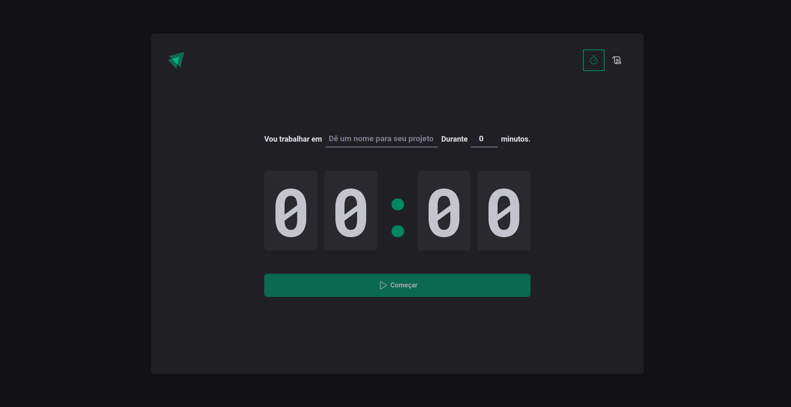
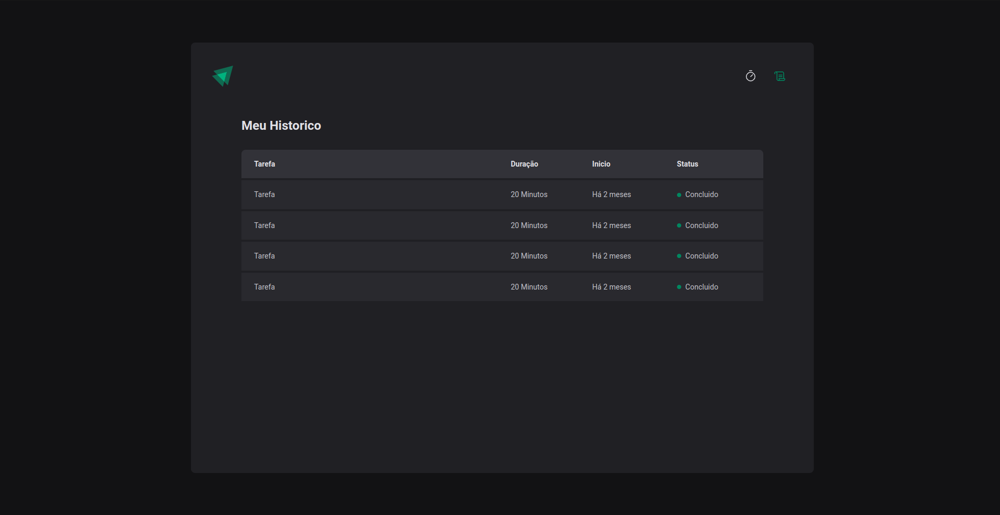

   

# Ignite Pomodoro

It's a medium application created to control cycles of pomodoro, this project was create to improve my knowledge of React, Styled-Components and CSS. (still under development).

# How to run

1 Clone the repository into your machine.

2 You will need NodeJS/ NPM to run, you can download [here](https://nodejs.org/en).

3 Execute `npm run dev`.

4 Open into you Browser the address: `http://localhost:5173`.

# Features

- [x] Create a new cycle with name and duration.
- [x] Consult the history of my previous cycles.
- [ ] Interupt timer of current cycle.

# Preview

## Home

## History

